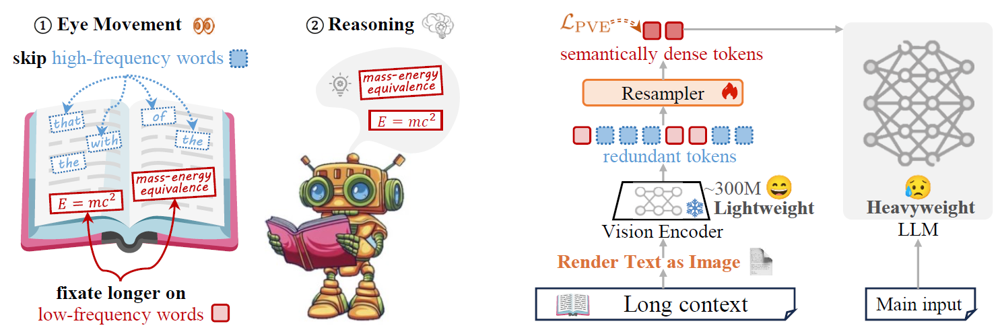
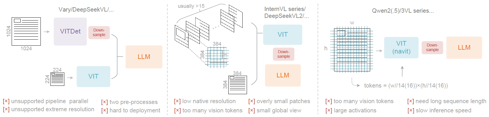

# Awesome Papers on Text-as-Image Compression for Large Models

A curated list of must-read papers on leveraging the visual representation of text to compress input, extend the context window, and enhance the efficiency of Large Language Models (LLMs) and Multimodal Large Language Models (MLLMs).

## 📢 News
- **[2025-10-27]** This paper list is created! 🎉🎉🎉

## 💡 Introduction

The quadratic complexity of self-attention mechanisms in Large Language Models (LLMs) presents a significant bottleneck for processing long-text inputs. A groundbreaking paradigm has emerged that circumvents traditional text tokenizers by representing text as pixels. This "text-as-image" approach allows powerful vision encoders to "read" and compress information, transforming a long sequence of text tokens into a much shorter sequence of visual tokens. This method not only promises to dramatically extend the effective context length of models but also inherently handles challenges like multi-language processing and noisy text with a unified solution. The current state-of-the-art is moving towards creating highly efficient, intelligent compression systems that are ready for real-world application, extending the capabilities of models to handle entire documents, books, and codebases seamlessly.

This research area has progressed from foundational works establishing the viability of pixel-based language learning to more advanced frameworks focused on optimization and practical application. The initial stage proved that models could learn language directly from rendered text, bypassing vocabulary limitations. Subsequent research focused on enhancing the performance of these models and explicitly framing the technique as a method for input compression, quantifying its efficiency gains. The latest stage involves the development of sophisticated, end-to-end frameworks that employ intelligent architectures, often mimicking human reading behaviors, to achieve state-of-the-art compression efficiency and performance.

## Table of Contents

- [Pixel-Based Representation and Modeling](#pixel-based-representation-and-modeling)
- [Performance Enhancement and Efficiency Analysis](#performance-enhancement-and-efficiency-analysis)
- [Integrated Systems and End-to-End Solutions](#integrated-systems-and-end-to-end-solutions)
- [Contributing](#contributing)

---

## Pixel-Based Representation and Modeling

*This section includes foundational papers that established the "text-as-image" paradigm, proving that language and document structure can be learned directly from pixels.*

- **[Language Modelling with Pixels (PIXEL)](https://arxiv.org/abs/2207.06991)**  
  *Phillip Rust, Jonas F. Lotz, Emanuele Bugliarello, Elizabeth Salesky, Miryam de Lhoneux, Desmond Elliott*  
  **ICLR 2023**  
  - **Core Problem**: Traditional subword-based tokenizers face a "vocabulary bottleneck," leading to over-segmentation and poor handling of multilingual or noisy text.
  - **Methodology**: Introduced PIXEL, a model that renders text into images and uses a masked autoencoder (MAE) architecture to learn language by reconstructing masked image patches.
  - **Key Contributions**: Pioneered a fully "pixels-only" approach to language modeling, demonstrating that a model can learn linguistic properties without a conventional text tokenizer.

- **[Pix2Struct: Screenshot Parsing as Pretraining for Visual Language Understanding](https://arxiv.org/abs/2210.03347)**  
  *Kenton Lee, Mandar Joshi, Iulia Turc, Hexiang Hu, Fangyu Liu, Julian Eisenschlos, Urvashi Khandelwal, Peter Shaw, Ming-Wei Chang, Kristina Toutanova*  
  **ICML 2023**  
  - **Core Problem**: How to create a general-purpose model that can understand visually-situated language (e.g., in UIs, charts) without relying on external OCR tools.
  - **Methodology**: Proposed Pix2Struct, which is pretrained on a "screenshot parsing" task to convert masked visual information into simplified HTML or text structures.
  - **Key Contributions**: Established an end-to-end pretraining strategy for parsing complex visual documents, laying the groundwork for subsequent OCR-free document AI models.

- **[CLIPPO: Image-and-Language Understanding from Pixels Only](https://arxiv.org/abs/2212.08045)**  
  *Michael Tschannen, Basil Mustafa, Neil Houlsby*  
  **ICML 2023**  
  - **Core Problem**: Can a single, unified model architecture handle both image and text modalities without separate, modality-specific components?
  - **Methodology**: Developed CLIPPO, which uses a single shared Vision Transformer to encode both standard images and text rendered as images, trained via contrastive learning.
  - **Key Contributions**: Proved that a "pixels-only" model can achieve strong image-text understanding, providing an architectural justification for using a unified vision encoder for multimodal tasks.

- **[Nougat: Neural Optical Understanding for Academic Documents](https://arxiv.org/abs/2308.13418)**  
  *Lukas Blecher, Guillem Cucurull, Thomas Scialom, Robert Stojnic*  
  **arXiv 2023**  
  - **Core Problem**: The PDF format for scientific documents leads to a loss of semantic information, especially for mathematical expressions, making automated extraction difficult.
  - **Methodology**: Proposed Nougat, a Visual Transformer model that performs an end-to-end OCR task, converting images of scientific document pages into a lightweight markup language.
  - **Key Contributions**: Provided a promising solution to bridge the gap between human-readable scientific PDFs and machine-readable text, enhancing the accessibility of scientific knowledge.

- **[PaddleOCR 3.0 Technical Report](https://arxiv.org/abs/2507.05595)**  
  *Cheng Cui, Ting Sun, Manhui Lin, Tingquan Gao, et al.*  
  **arXiv 2025**  
  - **Core Problem**: Growing demand for high-performance, efficient, and versatile OCR and document parsing in the era of large language models.
  - **Methodology**: Introduced a suite of solutions including PP-OCRv5 (multilingual text recognition), PP-StructureV3 (hierarchical document parsing), and PP-ChatOCRv4 (key information extraction), all designed to be lightweight (<100M parameters).
  - **Key Contributions**: Delivered a comprehensive, open-source OCR toolkit with specialized models that achieve competitive accuracy and efficiency compared to billion-parameter VLMs, supporting a wide range of real-world document intelligence applications.

## Performance Enhancement and Efficiency Analysis

*This section covers papers that analyze, optimize, and quantify the performance and efficiency of text-as-image methods, particularly for context compression.*

- **[Improving Language Understanding from Screenshots by Patch-and-Text Pre-training](https://arxiv.org/abs/2402.14073)**  
  *Tianyu Gao, Zirui Wang, Adithya Bhaskar, Danqi Chen*  
  **ICLR 2024**  
  - **Core Problem**: Pixel-based models like PIXEL underperform traditional text-based models (e.g., BERT) on standard language understanding benchmarks.
  - **Methodology**: Introduced the Patch-and-Text Prediction (PTP) pretraining objective, which requires the model to simultaneously reconstruct masked image patches and predict the original masked text.
  - **Key Contributions**: Significantly improved the language understanding capabilities of pixel-based models by bridging visual and textual learning, making them more competitive with text-native models.

- **[Text or Pixels? It Takes Half: On the Token Efficiency of Visual Text Inputs in Multimodal LLMs](https://arxiv.org/abs/2510.18279)**  
  *Yanhong Li, Zixuan Lan, Jiawei Zhou*  
  **arXiv 2025**  
  - **Core Problem**: Can rendering text as an image serve as an effective compression technique for long-context tasks in Multimodal Large Language Models (MLLMs)?
  - **Methodology**: Conducted a systematic empirical study on long-text tasks, comparing the performance and token efficiency of text-based versus pixel-based inputs.
  - **Key Contributions**: Provided the first quantitative evidence that the text-as-image approach can achieve comparable performance with nearly half the token cost, explicitly validating its use for input compression.

- **[Leveraging Visual Tokens for Extended Text Contexts in Multi-Modal Learning](https://arxiv.org/abs/2406.02547)**  
  *Alex Jinpeng Wang, Linjie Li, Yiqi Lin, Min Li, Lijuan Wang, Mike Zheng Shou*  
  **arXiv 2024**  
  - **Core Problem**: The computational cost of processing long text sequences during the training of MLLMs is prohibitively high.
  - **Methodology**: Proposed VisInContext, a hybrid method where out-of-context text is rendered as an image and processed by a vision encoder, while core text is fed directly to the LLM.
  - **Key Contributions**: Introduced an efficient training strategy that extends the effective context length of MLLMs by offloading long-range dependencies to the visual modality.

- **[SEE THE TEXT: FROM TOKENIZATION TO VISUAL READING](https://arxiv.org/abs/2510.18840)**  
  *Ling Xing, Alex Jinpeng Wang, Rui Yan, Hongyu Qu, Zechao Li, Jinhui Tang*  
  **arXiv 2025**  
  - **Core Problem**: Subword tokenization is inefficient for low-resource languages, sensitive to noise, and discards visual cues inherent in text.
  - **Methodology**: Proposed SEETOK, which renders text as images and uses a pretrained MLLM adapted with lightweight LoRA layers to interpret "visual-text instructions."
  - **Key Contributions**: Demonstrated a vision-centric alternative to tokenization that matches or surpasses subword methods in performance while requiring significantly fewer tokens, offering better multilingual fairness and robustness.

## Integrated Systems and End-to-End Solutions

*This section focuses on papers that propose advanced, systemic frameworks and complete end-to-end models for OCR, document parsing, and visual context compression.*

- **[General OCR Theory: Towards OCR-2.0 via a Unified End-to-end Model](https://arxiv.org/abs/2409.01704)**  
  *Haoran Wei, Chenglong Liu, Jinyue Chen, Jia Wang, et al.*  
  **arXiv 2024**  
  - **Core Problem**: Traditional OCR-1.0 systems are modular and task-specific, while LVLMs are too large and costly for specialized perception tasks. A unified, efficient, and versatile OCR-2.0 model is needed.
  - **Methodology**: Proposed GOT, a 580M parameter end-to-end model with a high-compression encoder and a long-context decoder, designed to handle "general optical characters" (text, formulas, charts, etc.).
  - **Key Contributions**: Introduced the "General OCR Theory" and an accompanying model (GOT) that is versatile, end-to-end, and cost-effective, aiming to define the next generation of OCR technology.

- **[Glyph: Scaling Context Windows via Visual-Text Compression](https://arxiv.org/abs/2510.17800)**  
  *Jiale Cheng, Yusen Liu, Xinyu Zhang, Yulin Fei, et al.*  
  **arXiv 2025**  
  - **Core Problem**: How to scale text-as-image compression to handle million-token contexts (e.g., entire books) while maintaining high fidelity.
  - **Methodology**: Developed Glyph, a framework that renders ultra-long text into compact image sequences. It uses an LLM-driven genetic algorithm to automatically find the optimal rendering configuration (font, layout) for maximum compression and accuracy.
  - **Key Contributions**: Systematized the rendering process itself as an optimizable problem, enabling robust and effective compression for extreme-scale contexts.

- **[Vision-centric Token Compression in Large Language Model](https://arxiv.org/abs/2502.00791)**  
  *Ling Xing, Alex Jinpeng Wang, Rui Yan, Xiangbo Shu, Jinhui Tang*  
  **arXiv 2025**  
  - **Core Problem**: How to design a compression framework that is not only efficient but also intelligent, mimicking human reading strategies to reduce redundancy in long contexts.
  - **Methodology**: Proposed VIST, a "slow-fast" framework where a lightweight vision encoder "skims" distant context (fast path) and the LLM "reads" core context (slow path). It uses a Probability-Informed Visual Enhancement (PVE) objective to focus on low-frequency, high-information words.
  - **Key Contributions**: Presented a state-of-the-art framework that intelligently allocates computational resources, moving the field from simple compression to highly efficient and cognitively inspired systems.

- **[DeepSeek-OCR: Contexts Optical Compression](https://arxiv.org/abs/2510.18234)**  
  *Haoran Wei, Yaofeng Sun, Yukun Li*  
  **DeepSeek-AI**  
  - **Core Problem**: To investigate the feasibility of compressing long contexts via optical 2D mapping and to determine the vision token requirements for accurate decoding.
  - **Methodology**: Developed DeepSeek-OCR, featuring a novel "DeepEncoder" that maintains low activation memory and minimal vision tokens at high resolutions, paired with a DeepSeek3B-MoE decoder.
  - **Key Contributions**: Provided a quantitative analysis of vision-text compression ratios (e.g., >96% precision at <10x compression) and an efficient, production-ready OCR model that outperforms competitors while using significantly fewer vision tokens.

- **[PaddleOCR-VL: Boosting Multilingual Document Parsing via a 0.9B Ultra-Compact Vision-Language Model](https://arxiv.org/abs/2510.14528)**  
  *Cheng Cui, Ting Sun, Suyin Liang, Tingquan Gao, et al.*  
  **arXiv 2025**  
  - **Core Problem**: Existing document parsing methods are either complex multi-model pipelines with error propagation or resource-intensive end-to-end VLMs that struggle with complex layouts.
  - **Methodology**: Proposed PaddleOCR-VL, a two-stage system combining a lightweight layout analysis model (PP-DocLayoutV2) with a compact 0.9B VLM for element-level recognition, trained on a systematically constructed high-quality dataset.
  - **Key Contributions**: Achieved SOTA performance on document parsing benchmarks with a resource-efficient model that outperforms larger VLMs and pipeline solutions, supporting 109 languages and complex elements like tables, formulas, and charts.

---

## Contributing

This list is a work in progress and is continuously updated. If you have any suggestions for papers to add or improvements to make, please feel free to open an issue or submit a pull request. Your contributions are greatly appreciated!
